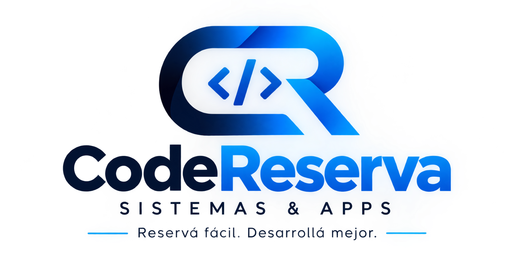

<div align="center">



# 💻 CodeReserva — Sistemas & Apps

### 💡 Reservá fácil. Desarrollá mejor.

**Plataforma web para registrar y gestionar los servicios de desarrollo de software
(sistemas, apps y desarrollo web) que ofrece la empresa.**

Hecha con **Django**, **Bootstrap 5** y mucho cariño. 💙
Proyecto final de la _Aceleración Tech de [Alkemy](https://www.alkemy.org)_.


</div>

---

## 📋 Tabla de contenidos

- [✨ Sobre el proyecto](#-sobre-el-proyecto)
- [🎯 Características](#-características)
- [🛠️ Stack tecnológico](#️-stack-tecnológico)
- [🚀 Puesta en marcha](#-puesta-en-marcha)
- [🐳 Puesta en marcha con Podman](#-puesta-en-marcha-con-podman-un-solo-comando)
- [📁 Estructura del proyecto](#-estructura-del-proyecto)
- [🗺️ Mapa de rutas](#️-mapa-de-rutas)
- [📡 Swagger y documentación de la API](#-swagger-y-documentación-de-la-api)
- [🧱 Modelos de datos](#-modelos-de-datos)
- [🤝 Convenciones de trabajo en equipo](#-convenciones-de-trabajo-en-equipo)
- [🗺️ Roadmap](#️-roadmap)

---

## ✨ Sobre el proyecto

Esta web nace de la necesidad de **una empresa de desarrollo de software** de tener
un lugar único y ordenado donde registrar los servicios que ofrece (desarrollo web,
apps móviles, sistemas a medida, e-commerce, cloud, soporte), los clientes que los
contratan y las reservas de fecha que se generan a partir de eso.

El objetivo es simple: reemplazar la planilla desordenada y las anotaciones sueltas
por **una herramienta limpia, rápida y fácil de usar** para todo el equipo.

> 💡 Construida durante la _Aceleración Tech de Alkemy_, como proyecto final que
> integra todo lo aprendido: Django a fondo, modelos con relaciones y validaciones,
> CRUD completo, **sesiones de usuario**, **generación de PDFs** y buenas prácticas
> de trabajo en equipo con Git.

<!-- 🖼️ TODO v2: Captura de la home -->
<!-- 🖼️ TODO v2: Captura del panel interno -->
<!-- 🖼️ TODO v2: Captura del comprobante PDF -->

---

## 🎯 Características

### 🏢 Para el público (cliente)

✅ **Catálogo de servicios** — la home pública muestra los servicios de desarrollo activos con su precio.

✅ **Solicitud de reserva** — el cliente deja sus datos y el servicio que le interesa; el equipo lo contacta para confirmar.

✅ **Consulta por DNI** — el cliente consulta el estado de sus solicitudes y reservas sin necesidad de registrarse.

### 🔐 Para el personal (panel interno con sesiones)

✅ **Sesiones de usuario** — login con **legajo y DNI** como contraseña. El usuario se crea automáticamente a partir del empleado (`Empleado.sincronizar_usuario`).

✅ **Panel (dashboard)** — métricas del negocio: reservas de hoy, próximas reservas, servicios y clientes activos, personal disponible y solicitudes pendientes.

✅ **CRUD completo de servicios** — crear, editar, listar y dar de baja servicios con nombre, descripción y precio.

✅ **CRUD de clientes, coordinadores y empleados** — gestión completa de la cartera y del equipo.

✅ **CRUD de reservas** — alta, edición, baja y listado de reservas con fecha de inicio del servicio.

### 🧾 Todas las apps

✅ **Comprobante PDF** — cada reserva se puede descargar como **PDF** con los datos completos (generado con ReportLab).

✅ **Baja lógica** — los registros no se borran, se desactivan. Se pueden restaurar cuando haga falta, sin perder historial.

✅ **Listados de activos e inactivos** — todo separado y visible: lo vigente por un lado, lo archivado por otro.

✅ **Validaciones de reservas** — evita reservar servicios inactivos y dobles reservas en una misma fecha.

✅ **Solicitudes con flujo completo** — pendiente → aceptada (crea la reserva y el cliente si no existe) o rechazada.

✅ **API REST + Swagger** — CRUD completo de servicios, clientes, empleados, coordinadores y reservas.

✅ **Interfaz responsive con Bootstrap 5** — navbar, footer y branding propios en tonos azul oscuro.

✅ **Panel de administración de Django** — gestión avanzada incluida de fábrica.

---

## 🛠️ Stack tecnológico

| Tecnología               | ¿Para qué?                                                              |
| ------------------------ | ----------------------------------------------------------------------- |
| 🐍 **Python 3.12**       | Lenguaje de programación del backend.                                   |
| 🌐 **Django 6.1**        | Framework web: modelos, vistas, formularios, rutas y sesiones.          |
| 🎨 **Bootstrap 5.3**     | Interfaz de usuario moderna y responsive.                               |
| 🧾 **ReportLab**         | Generación del comprobante PDF de cada reserva.                         |
| 🗃️ **SQLite**            | Base de datos ligera para desarrollo.                                   |
| 🐳 **Podman**            | Contenedor opcional para levantar todo con un solo comando.             |

---

## 🚀 Puesta en marcha

Seguí estos pasos y en un minuto tenés el proyecto corriendo en tu máquina. 🏃

### 1. Requisitos previos

- **Python 3.12** o superior instalado.
- **Git** para clonar el repositorio.

Verificá tu versión:

```bash
python3 --version
```

### 2. Clonar el repositorio

```bash
git clone https://github.com/can197845/Web-Servicios-Para-Eventos.git
cd Web-Servicios-Para-Eventos
```

### 3. Crear y activar el entorno virtual

```bash
python3 -m venv venv
source venv/bin/activate        # Linux / macOS
venv\Scripts\activate           # Windows
```

### 4. Instalar las dependencias

```bash
pip install django djangorestframework drf-spectacular reportlab
```

> 💡 La app `api` expone endpoints REST con **DRF** (`djangorestframework`) y su
> documentación OpenAPI se genera automáticamente con **drf-spectacular**.
> Los comprobantes PDF se generan con **ReportLab**.

### 5. Preparar la base de datos

```bash
cd WebApp
python manage.py makemigrations   # solo la primera vez o si cambian los modelos
python manage.py migrate
```

### 6. (Opcional) Cargar datos de ejemplo

```bash
python manage.py seed
```

> 💡 El comando `seed` siembra servicios de desarrollo, clientes, coordinadores y
> empleados de ejemplo. Para los empleados activos **crea automáticamente su usuario
> de acceso** (legajo + DNI). Probá con:
>
> - **Legajo `1`** / contraseña `27111222` → empleado activo.
> - Para forzar una carga limpia: `python manage.py seed --force`.

### 7. Crear el superusuario (opcional, para el admin)

```bash
python manage.py createsuperuser
```

### 8. ¡A correr! 🚀

```bash
python manage.py runserver
```

Abrí **http://127.0.0.1:8000/** en tu navegador y listo.

> 💡 ¿No querés instalar nada en tu máquina? Probá la opción con **Podman** 👇

---

## 🐳 Puesta en marcha con Podman (un solo comando)

Alternativa que levanta **todo el asunto** (entorno + Django + migraciones +
**seed de datos** + superusuario + servidor) dentro de un contenedor, sin tocar tu
sistema. La base de datos y las migraciones se generan en tu carpeta `WebApp/`,
igual que en el flujo manual.

### 1. Requisitos previos

- **Podman** instalado (con el plugin **compose**: `podman-compose` o `docker-compose`).
- **Git** para clonar el repositorio.

### 2. Clonar el repositorio

```bash
git clone https://github.com/can197845/Web-Servicios-Para-Eventos.git
cd Web-Servicios-Para-Eventos
```

### 3. ¡A correr! 🚀

```bash
podman compose up
```

La primera vez construye la imagen (tarda un poco); las siguientes arranca al
instante. Cuando termina de migrar, sembrar los datos de ejemplo (`seed`) y crear el
superusuario, levanta el server.

Abrí **http://127.0.0.1:8000/** y el admin en **http://127.0.0.1:8000/admin/**
(usuario `admin`, contraseña `admin` — solo para desarrollo).

Para probar el panel interno con sesiones, usá un empleado del seed:
**legajo `1`**, contraseña `27111222`.

Para apagar: `Ctrl+C` y luego `podman compose down`.
Si cambiás el `Dockerfile` o las dependencias: `podman compose up --build`.

> ⚠️ Si el `runserver` manual está usando el puerto `8000`, apagalo antes de
> levantar el contenedor (o el puerto va a estar ocupado).

---

## 📁 Estructura del proyecto

```text
.
└── Web-Servicios-Para-Eventos/
    ├── .gitignore
    ├── .dockerignore
    ├── Dockerfile
    ├── compose.yaml
    ├── entrypoint.sh
    ├── Sprint_1_Tareas_Trello_Django.pdf
    ├── Sprint_2_Tareas_Trello.pdf
    └── WebApp/
        ├── manage.py
        ├── static/
        │   └── logo.png
        ├── WebApp/
        │   ├── __init__.py
        │   ├── asgi.py
        │   ├── settings.py
        │   ├── urls.py
        │   └── wsgi.py
        ├── api/                    # API REST (DRF) + schema OpenAPI
        │   ├── __init__.py
        │   ├── admin.py
        │   ├── serializers.py
        │   ├── urls.py
        │   ├── views.py
        │   └── tests.py
        ├── servicios/              # App principal (modelos, vistas y CRUD)
        │   ├── __init__.py
        │   ├── admin.py
        │   ├── apps.py
        │   ├── base_views.py       # Baja lógica y restauración (con sesión)
        │   ├── context_processors.py
        │   ├── forms.py
        │   ├── models.py
        │   ├── tests.py
        │   ├── urls.py
        │   ├── views.py
        │   ├── management/
        │   │   └── commands/
        │   │       └── seed.py     # Datos de ejemplo + usuarios de empleados
        │   └── migrations/
        └── templates/
            ├── base.html           # Navbar + footer con marca y sesión
            ├── dashboard.html      # Panel interno del personal
            ├── home.html           # Home pública (catálogo)
            ├── login.html          # Acceso del personal (legajo + DNI)
            ├── servicios/          # CRUD servicios
            ├── clientes/           # CRUD clientes
            ├── coordinadores/      # CRUD coordinadores
            ├── empleados/          # CRUD empleados
            ├── reservas/           # Listado, form, solicitar y consultar
            └── solicitudes/        # Bandeja de solicitudes (atender/rechazar)
```

---

## 🗺️ Mapa de rutas

### 🏠 Público (cliente)

| Ruta            | Vista              | Descripción                                          |
| --------------- | ------------------ | ---------------------------------------------------- |
| `/`             | `home`             | Home con catálogo de servicios activos.              |
| `/reservar/`    | `solicitud_reserva`| Formulario público de solicitud de reserva.          |
| `/consultar/`   | `consulta_reserva` | Consulta del estado de reservas por DNI (+ PDF).     |

### 🔐 Acceso y panel interno (personal)

| Ruta         | Vista      | Descripción                                         |
| ------------ | ---------- | --------------------------------------------------- |
| `/ingresar/` | `ingresar` | Login del personal (legajo + contraseña DNI).       |
| `/salir/`    | `salir`    | Cierre de sesión.                                   |
| `/panel/`    | `dashboard`| Panel con métricas del negocio.                     |

### 💻 Servicios

| Ruta                            | Vista                 | Descripción                             |
| ------------------------------- | --------------------- | --------------------------------------- |
| `/servicios/`                   | `listar_servicios`    | Listado de servicios activos.           |
| `/servicios/nuevo/`             | `crear_servicio`      | Alta de un servicio.                    |
| `/servicios/editar/<pk>/`       | `editar_servicio`     | Edición de un servicio.                 |
| `/servicios/eliminar/<pk>/`     | `BajaServicio`        | Baja lógica de un servicio.             |
| `/servicios/inactivos/`         | `listar_inactivos`    | Servicios dados de baja.                |
| `/servicios/restaurar/<pk>/`    | `RestaurarServicio`   | Reactivar un servicio.                  |

### 📅 Reservas

| Ruta                          | Vista              | Descripción                                        |
| ----------------------------- | ------------------ | -------------------------------------------------- |
| `/reservas/`                  | `listar_reservas`  | Listado de reservas.                               |
| `/reservas/nueva/`            | `crear_reserva`    | Alta de una reserva.                               |
| `/reservas/editar/<pk>/`      | `editar_reserva`   | Edición de una reserva.                            |
| `/reservas/eliminar/<pk>/`    | `eliminar_reserva` | Eliminación de una reserva.                        |
| `/reservas/imprimir/<pk>/`    | `datos_reserva`    | **Comprobante PDF** de la reserva (ReportLab).     |

### 📥 Solicitudes de reserva

| Ruta                               | Vista               | Descripción                                        |
| ---------------------------------- | ------------------- | -------------------------------------------------- |
| `/solicitudes/`                    | `listar_solicitudes`| Bandeja: pendientes + historial.                   |
| `/solicitudes/atender/<pk>/`       | `atender_solicitud` | Confirma y crea la reserva (+ cliente si no existe).|
| `/solicitudes/rechazar/<pk>/`      | `rechazar_solicitud`| Rechaza la solicitud.                              |

### 🧑‍🤝‍🧑 Clientes

| Ruta                        | Vista                         | Descripción                  |
| --------------------------- | ----------------------------- | ---------------------------- |
| `/clientes/`                | `listar_clientes`             | Listado de clientes activos. |
| `/clientes/nuevo/`          | `crear_cliente`               | Alta de un cliente.          |
| `/clientes/editar/<pk>/`    | `editar_cliente`              | Edición de un cliente.       |
| `/clientes/eliminar/<pk>/`  | `BajaCliente`                 | Baja lógica de un cliente.   |
| `/clientes/inactivos/`      | `listar_clientes_inactivos`   | Clientes dados de baja.      |
| `/clientes/restaurar/<pk>/` | `RestaurarCliente`            | Reactivar un cliente.        |

### 🗂️ Coordinadores

| Ruta                              | Vista                   | Descripción                     |
| --------------------------------- | ----------------------- | ------------------------------- |
| `/coordinadores/`                 | `listar_coordinadores`  | Listado de coordinadores activos.|
| `/coordinadores/nuevo/`           | `agregar_coordinador`   | Alta de un coordinador.         |
| `/coordinadores/editar/<pk>/`     | `editar_coordinador`    | Edición de un coordinador.      |
| `/coordinadores/eliminar/<pk>/`   | `BajaCoordinador`       | Baja lógica.                    |
| `/coordinadores/inactivos/`       | `coordinadores_inactivos`| Dados de baja.                 |
| `/coordinadores/restaurar/<pk>/`  | `RestaurarCoordinador`  | Reactivar.                      |

### 👷 Empleados

| Ruta                       | Vista                  | Descripción                    |
| -------------------------- | ---------------------- | ------------------------------ |
| `/empleados/`              | `listar_empleados`     | Listado de empleados activos.  |
| `/empleados/editar/<pk>/`  | `editar_empleado`      | Edición (+ sincroniza usuario).|
| `/empleados/eliminar/<pk>/`| `BajaEmpleado`         | Baja lógica (desactiva usuario).|
| `/empleados/inactivos/`    | `empleados_inactivos`  | Dados de baja.                 |
| `/empleados/restaurar/<pk>/`| `RestaurarEmpleado`   | Reactivar (reactiva usuario).  |

---

## 📡 Swagger y documentación de la API

La app **`api`** expone un CRUD REST completo de **servicios**, **clientes**,
**empleados**, **coordinadores** y **reservas**. El schema **OpenAPI 3** se genera
automáticamente con [drf-spectacular](https://drf-spectacular.readthedocs.io/)
a partir de los ViewSets y serializers, sin anotar cada endpoint a mano.

| Ruta              | ¿Qué es?                                                                        |
| ----------------- | ------------------------------------------------------------------------------- |
| `/api/`           | Raíz navegable de la API (Browsable API de DRF).                                |
| `/api/docs/`      | **Swagger UI** interactiva: explorá y probá cada endpoint desde el navegador.  |
| `/api/descarga/`  | Descargá el schema OpenAPI completo en formato JSON (`reserva-api-schema.json`). |

> 💡 La interfaz de Swagger UI se sirve desde el CDN de jsdelivr, por lo que hace
> falta **conexión a internet** para verla. Desde el menú **API** del navbar
> llegás a la documentación y a la descarga del schema.

---

## 🧱 Modelos de datos

| Modelo                | Descripción                                                               |
| --------------------- | ------------------------------------------------------------------------- |
| **`Persona`**         | Clase base abstracta con `nombre`, `apellido`, `numero_documento` y `activo`. |
| **`Servicio`**        | Servicio de desarrollo que ofrece la empresa: nombre, descripción y precio.|
| **`Cliente`**         | Hereda de `Persona`. Agrega `telefono` y `email`. Quien contrata.         |
| **`Coordinador`**     | Hereda de `Persona`. Agrega `fecha_alta`.                                 |
| **`Empleado`**        | Hereda de `Persona`. Agrega `numero_legajo` y su **`usuario`** de acceso (auth). |
| **`ReservaServicio`** | Relaciona cliente + servicio + empleado + coordinador en una fecha.       |
| **`SolicitudReserva`**| Pedido público de reserva con estado `pendiente` / `aceptada` / `rechazada` y vínculo a la reserva creada. |

> 🔒 **Validaciones de `ReservaServicio`:** al guardar una reserva, Django
> verifica automáticamente que el servicio esté **activo** y que **no exista
> otra reserva para ese servicio en la misma fecha**.

> 👤 **Empleados y sesiones:** cada empleado tiene vinculado un usuario de Django
> (`Empleado.usuario`) cuyo acceso es `numero_legajo` y contraseña `numero_documento`.
> Se crea/actualiza automáticamente al guardar el empleado (admin, formulario o seed),
> y la baja/restauración lógica activa o desactiva ese usuario.

---

## 🤝 Convenciones de trabajo en equipo

### Mensajes de commit

Mantenemos los commits claros y con prefijo, para que el historial se lea solo:

```text
feature: <tarea implementada>
fix:     <corrección de bug / error>
chore:   <tareas de mantenimiento>
```

### Ramas

Trabajamos sobre ramas por integrante y se integran en `develop`:

- `main` — versión estable.
- `develop` — integración de las ramas de trabajo.
- `Andres-Movia`, `Jorge-Canosa`, `ramiro`, `rodrigo`, … — ramas por integrante.

### Actualización (cada pull)

⚠️ Las migraciones y la base de datos (`db.sqlite3`) **no se suben al repo**:
cada integrante genera las suyas localmente.

> ⚠️ Si llegaron **dependencias nuevas**, instalalas antes de correr el server
> (por ejemplo `pip install drf-spectacular reportlab`).

```bash
git pull
python manage.py makemigrations   # solo si llegaron modelos nuevos/cambiados
python manage.py migrate
```

---

## 🗺️ Roadmap

Ideas y próximos pasos que le darían el salto al proyecto:

- [x] CRUD completo de **coordinadores**.
- [x] CRUD completo de **empleados** (con usuario de acceso).
- [x] Gestión de **reservas** desde la interfaz.
- [x] **Sesiones** de personal con panel interno.
- [x] Comprobante **PDF** de reservas.
- [x] Solicitud y **consulta de reservas** para el cliente.
- [x] **API** para integrar con otros sistemas.
- [ ] Módulo de **contacto**.
- [ ] Deploy a producción.

---

## 📜 Licencia

⚠️ **Por definir.** El proyecto todavía no tiene una licencia asignada.
¡Próximamente!

---

<div align="center">

Hecho con 💙 durante la _Aceleración Tech de [Alkemy](https://www.alkemy.org)_.

[](https://github.com/can197845/Web-Servicios-Para-Eventos)

</div>
